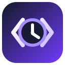

<p align="center">
  
</p>

<h1 align="center">LaraTimeCode</h1>

<p align="center">
  Turn failed Laravel requests into encrypted, replayable snapshots and Pest regression tests.
</p>

<p align="center">
  <a href="https://github.com/leonidtimo17/LaraTimeCode/actions/workflows/tests.yml"></a>
  <a href="https://packagist.org/packages/laratimecode/laratimecode"></a>
  <a href="https://packagist.org/packages/laratimecode/laratimecode"></a>
  <a href="LICENSE.md"></a>
</p>

```text
Production exception → encrypted .repro file → local replay → regression test
```

> [!WARNING]
> LaraTimeCode is alpha software. It replays requests against your local database
> and application state; it does not copy or restore production database rows.

## Why LaraTimeCode?

Logs tell you what failed. LaraTimeCode keeps the sanitized request context needed
to reproduce the failure, then converts it into a local debugging workflow:

- capture failed HTTP requests without replacing the original exception;
- redact secrets recursively and encrypt snapshots with your application key;
- inspect or replay a snapshot from Artisan;
- generate a Pest regression test as a starting point;
- automatically expire old snapshots.

## Requirements

- PHP 8.2 or newer
- Laravel 12 or 13

## Installation

Install the latest tagged release from Packagist:

```bash
composer require laratimecode/laratimecode
php artisan vendor:publish --tag=laratimecode-config
```

For local development before the Packagist release, add this repository as a
[Composer path repository](https://getcomposer.org/doc/05-repositories.md#path):

```json
{
    "repositories": [
        {
            "type": "path",
            "url": "../LaraTimeCode"
        }
    ]
}
```

Then run `composer require laratimecode/laratimecode:@dev`.

Capturing is deliberately opt-in:

```dotenv
LARATIMECODE_ENABLED=true
LARATIMECODE_ENCRYPT=true
LARATIMECODE_RETENTION_DAYS=14
LARATIMECODE_MAX_FILES=100
```

Encrypted snapshots use `APP_KEY`. Keep the relevant key available until its
snapshots have been decrypted or removed.

## Workflow

When a request throws an exception, LaraTimeCode writes a `.repro` snapshot to
`storage/laratimecode`.

```bash
# Find the snapshot ID
php artisan timecode:list

# Inspect sanitized metadata
php artisan timecode:show 20260817-120000-123456-abcd1234

# Replay the request in the current application
php artisan timecode:replay 20260817-120000-123456-abcd1234

# Optionally resolve and authenticate the captured Eloquent user
php artisan timecode:replay 20260817-120000-123456-abcd1234 --auth

# Generate a Pest regression test
php artisan timecode:make-test 20260817-120000-123456-abcd1234

# Remove the snapshot after the investigation
php artisan timecode:delete 20260817-120000-123456-abcd1234
```

Generated tests are placed in `tests/Feature/LaraTimeCode` and contain an
`assertSuccessful()` placeholder. Add the required factories or fixtures, then
replace the placeholder with the expected behavior.

## Captured context

- HTTP method, URI, query, input, and allowlisted headers
- route name, action, and parameters
- authenticated model class and identifier
- exception class, message, location, and bounded stack trace
- SQL text, duration, and connection name (bindings are off by default)
- outbound Laravel HTTP client URL, method, and status
- PHP, Laravel, environment, release, and `composer.lock` fingerprint

Snapshots are written atomically. Internal capture errors are logged as warnings
and never replace the application's original exception.

## Privacy and security

Passwords, tokens, cookies, authorization headers, API keys, and common payment
fields are redacted recursively. Add application-specific fields in
`config/laratimecode.php`:

```php
'redaction' => [
    'replacement' => '[REDACTED]',
    'fields' => [
        'password',
        'token',
        'authorization',
        'customer.ssn',
        '*.private_key',
    ],
],
```

Only allowlisted request headers are captured. IP addresses, database bindings,
and outbound response bodies are disabled by default. Review the configuration
against your privacy policy before production use. Encryption protects data at
rest, but does not make unnecessary data collection safe.

Please report vulnerabilities privately according to [SECURITY.md](SECURITY.md).

## Current limitations

- Database rows are not captured or restored.
- Uploaded files are represented by metadata, not copied.
- Outbound HTTP calls are context only; automatic faking is not implemented yet.
- Queue jobs, events, mail, feature flags, and cache state are not captured yet.
- Authentication replay supports Eloquent models resolvable by identifier.
- Production concurrency and load behavior need broader real-world testing.

See the public [roadmap](ROADMAP.md) for the planned progression toward deterministic
reproduction.

## Development

```bash
composer install
composer check
```

Contributions are welcome. Read [CONTRIBUTING.md](CONTRIBUTING.md) before opening a
pull request.

## License

LaraTimeCode is open-source software released under the [MIT license](LICENSE.md).
